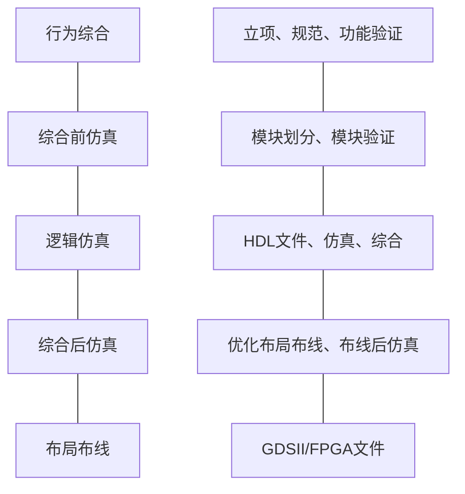

### 一、科普

| 缩略      | 全                             | 中文       |
| ------- | ----------------------------- | -------- |
| SSI     | small-scale IC                | 小规模集成电路  |
| VLSI    | very-large-scale IC           | 超大规模集成电路 |
| ULSI    | ultra-large-scale IC          | 甚大规模集成电路 |
| SoB     | system on board               | 版上系统     |
| SoC     | system on chip                | 片上系统     |
| SoW     | system on wafer               | 晶上系统     |
| RTL     | register transmit level       | 寄存器传输级   |
| HDL     | hardware description language | 硬件描述语言   |
| PLI     | program language interface    | 编程语言接口   |
| UDP     | user define primitive         | 用户定义原语   |
| ASIC    | Application Specific IC       | 专用集成电路   |
| FPGA    | Field Programmable Gate Array | 现场可编程门阵列 |
| IP      | Intellectual Property         | 可复用的功能模块 |
| Chiplet | $\phi$                        | 芯粒       |
- 建模层级：开关电路级 → 逻辑门级 → RTL → 算法级 → 系统级
- `VLSI`设计的一般流程（左：学业辅导群版，右：ppt版；不对齐）

### 二、基本概念
#### 1. 模块
```verilog

module module_name(pin01,pin02); #模块定义
//内容
endmodule
```
- 行为建模：阻塞赋值`=`，非阻塞赋值`<=`
- `4'ha6 → 4'b0110, 4'o06`
- 模块端口三种类型：`input, output, inout`
- 模块例化要写模块名，如`inst1,inst2`、exx → `e1,e2`
- 连续性赋值`vs.`过程性赋值：
	- 连续性赋值：在`module`中；与其他语句并行执行，右侧操作数的值改变时执行；驱动线网；使用=赋值符号；使用assign关键词
	- 过程性赋值：在`initial/always`语句中；语句执行与其周围语句有关系；驱动变量；用`=/<=`赋值；无assign关键词
- 循环关键词：`for, while, repeat, forever`
### 三、数据类型
- 四种逻辑值：`01xz`
- 主要数据类型：`reg, wire, integar, parameter`
#### 1. 常量和变量（`wire, reg`）
- 基数：如`4'b0010, 8'h3c`
- 字符串：`reg [8*7:1] msg = "abcdefg"`
- 标识符：开头→字母/下划线，后续→字母/下划线/数字/`$`
- 下划线：`8'b0011_1011`
- 反斜杠：`"\\", "\"", "%%" // \ " %`
- 负数：如`-8'd5`
- 修改==实例==（不是模块）参数：`defparam inst.param1=3`
- `reg`→存储器
	- 存储器不能直接赋值，只能对其中每个寄存器分别赋值，或用`readmem*`函数
#### 2. 运算符
#### 3. 数据流建模
- 连续赋值语句
- 每个#都代表一个等待时延结束的点，时延的最大值为脉冲不被覆盖的最大宽度
- `#(→1, →0, →Z)`：`→x`用最小值
#### 4. 门级结构建模
- 内置基本门
	- 多输入：`and, or, nand, nor, xor, xnor`
	- 多输出：`buf, not`
	- 三态：`{buf|not}if{0|1}`
	- 上拉、下拉：`pullup, pulldown`
	- MOS开关：`[r]{c|n|p}mos`
	- 双向开关：`[r]tran[if0|if1]`
#### 5. 
### 四、状态机
#### 1. 数电
- 组合逻辑电路 & 时序逻辑电路
- 功能描述 → 状态转移图 / 状态表 → HDL
#### 2. FSM
- 两种：$\begin{cases}摩尔\to output=F(state)\\米里\to output=F(state,input)\quad米里不是异步\end{cases}$
- 设计要点：初态、同/异步复位、多余状态的处理（`case`语句的`default`）
- 描述方式
	- 单过程：劣
	- 双过程：{现态+次态、输出}、{现态、次态+输出}
	- 三过程（推荐）：
		- 现态：`always@({pos|neg}edge clk or {pos|neg}edge async)`
		- 次态：`always@(state or sync)`，或者直接`always@(*)`
		- 输出：`always@(state)`
- 注意：`case`语句不能用`<=`，要有`default`和`endcase`
- `begin...end`：串行；`fork...join`：并行
#### 3. 编码
### 五、任务函数
#### 1. 任务`vs.`函数：
- 任务：✔延迟，✔调用任务和函数。对input、output、inout个数无要求，类型必须是==寄存器==，参数匹配按序不按地址【`.val(val)`】。
- 函数：🈲延迟，🈲调用任务。input个数$\geq1$。🈲output和inout，✔调用其他函数。
- 系统任务：不能延迟。
#### 2. 终端和文件
- `$display, $strobe, $monitor //输出默认10进制，可加上b,o,h`
- `$fopen, $fclose, $fdisplay, $fwrite, $fstrobe, $fmonitor //`
- `$readmemb, $readmemh`
	- `reg [1:0] mem1 [0:val1];`
	- `reg [15:0] mem2 [0:val2];`
	- `readmemb(文件名, mem1);`
	- `readmemh(文件名, mem2);`
- `$stop, $finish //停下、终止`
- `$random(seed) //伪随机数`
#### 3. 编译预指令
```verilog
`timescale 1ns/1ps #单位时间/时间精度
```
### 六、可重用设计
#### 1. 可综合
- tb文件不可综合
- fork...join, initial等不可综合
#### 2. 分频器：
- 参数定义分频周期：`NUM_DIV=周期`
- `always`语句里，计数到`NUM_DIV / 2 - 1`时输出翻转
- 奇数分频（如`2K+1`）用两个占空比为$\frac{K}{2K+1}$的信号取或