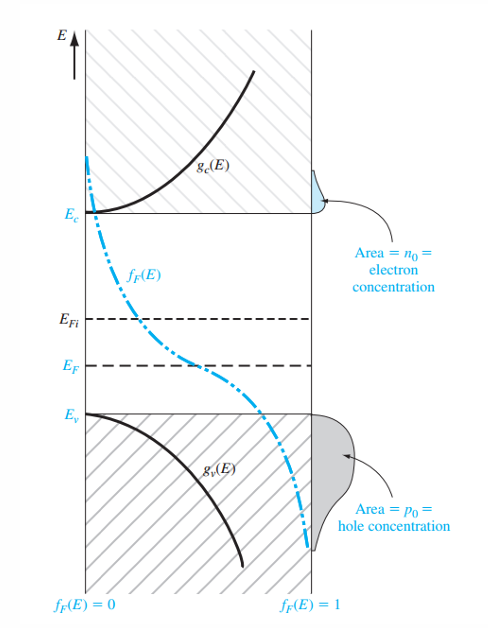
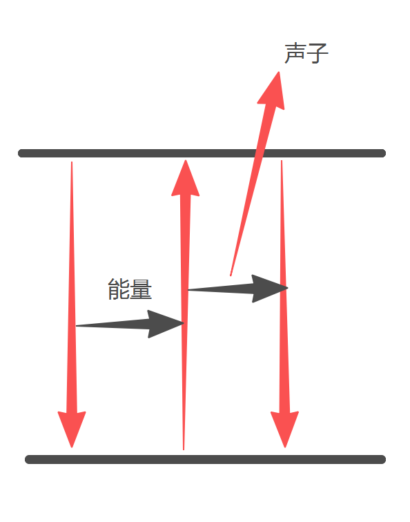
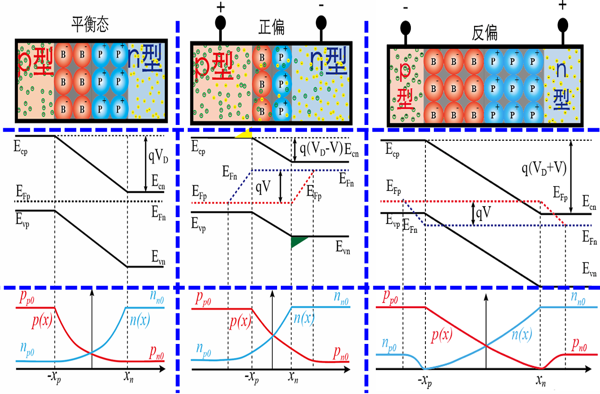
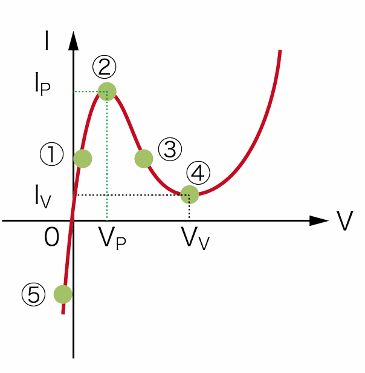
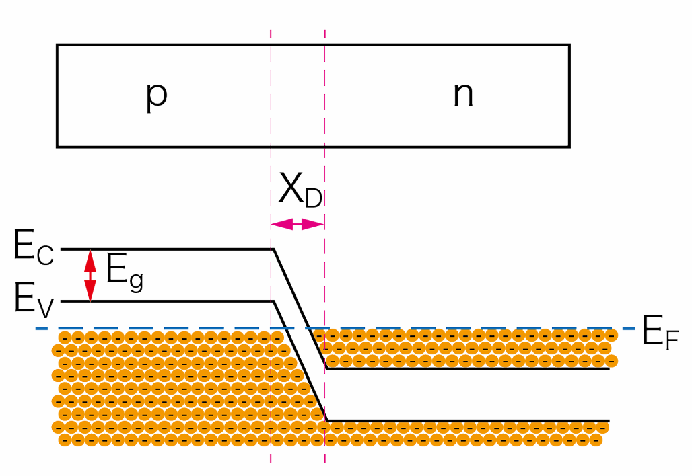
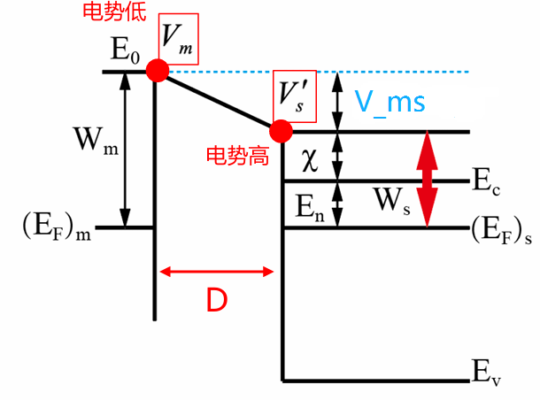
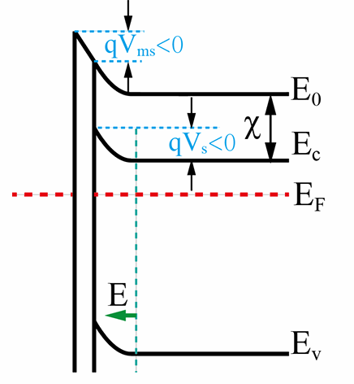
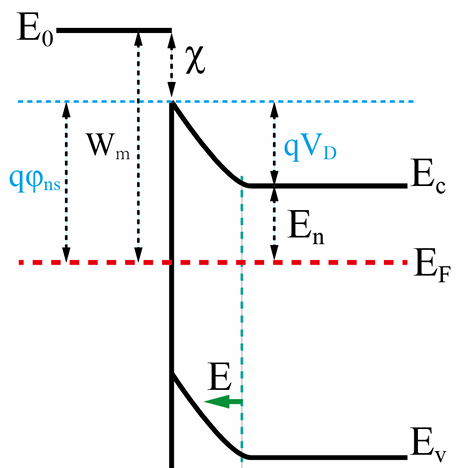
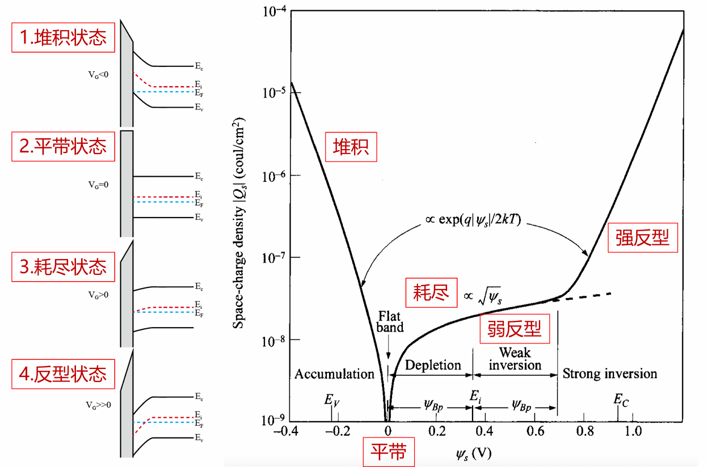
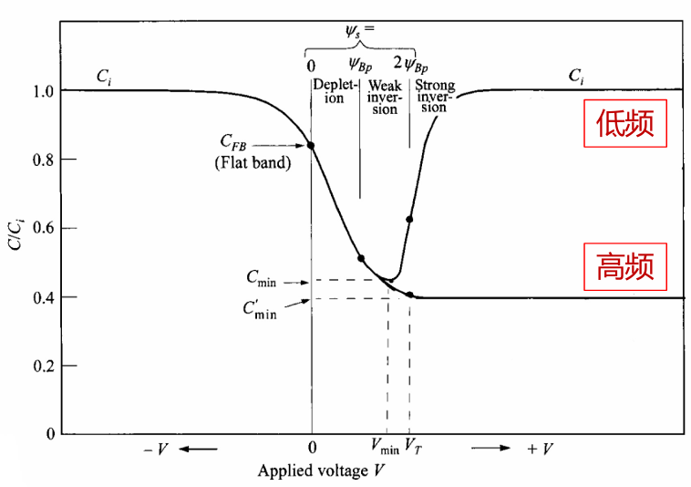

### 一、半导体中的电子状态
#### 1. 半导体材料结构
##### 1.0
- 温度、杂质缺陷、光照、磁场、电场都会影响半导体的导电特性
##### 1.1 类别
- 元素半导体：硅、锗
- 化合物半导体：二元、三元、四元化合物
##### 1.2 固体物理
- 固体分类：无定型、多晶、单晶→单晶硅
- 晶体结构：晶格、格点、原胞、晶胞
- 基本立方晶体晶胞：简立方、体心立方、面心立方
- 密勒指数（晶面）(100)、晶向\[100\]
##### 1.3 常见半导体的晶胞结构
- 金刚石结构、闪锌矿结构、纤锌矿结构、氯化钠结构
- 金刚石结构：共价键、正四面体、面心立方体对角线移位1/4体对角线长度套构而成晶胞（8个原子）
- 闪锌矿型结构：==两类原子==各自组成的面心立方晶格，沿体对角线方向彼此位移1/4体对角线长度套构而成，具有极性
#### 2. 半导体能带成因
##### 2.1 共有化运动
- 分立原子组成晶体后壳层交叠，出现电子共有化运动
- 原子能级分裂为晶体能带
- 能带特点
	- 允带+禁带
	- 内层电子受束缚强，共有化运动弱，能级分裂程度小，能带窄；
	- 外层电子受束缚弱，共有化运动强，能级分裂明显，能带宽
	- 能带中能级是“准连续的”
##### 2.2 轨道杂化
- 单晶硅 $sp^3$ 轨道杂化
- N个原子的晶体，分裂出两个能带，各包含2N状态
- 能量高的全空为导带，能带低的全满为价带，禁带宽度$E_g=E_C-E_V$
##### 2.3 半导体中电子状态
- 布洛赫定理及布洛赫波：$\Psi_k(x)=u_k(x)\exp\left(i2\pi kx\right)\quad u_k(x)=u_k(x+na)$
- 布里渊区：求解晶体中电子薛定谔方程，可得E(k)~k关系，在k=n/2a处出现能量不连续，K=n/L
- 电子不局限在某个原子上，外层电子共有化运动强，成为准自由电子
- 导体、半导体、绝缘体的能带：半满 → 全满+全空
#### 3. 半导体电子运动
##### 3.1 有效质量
- 定义：$E(k)-E(0)=\frac{h^2k^2}{2m_n^*}$（$E(k)-E(0)=\frac12\left(\frac{\partial^2E}{\partial k^2}\right)$）
	- $v=\frac{hk}{m_n^*}$，$hk$为准动量，不是电子真实动量， 只是与自由电子动量变化规则相似（$v=\frac{d\nu}{dk}=\frac1h\frac{dE}{dk}$）
	- $a=\frac{f}{m_n^*}$
- 意义
	- 概括半导体内部势场作用，在解决半导体中电子在外力作用下运动规律时不涉及半导体内部势场作用
	- 可以实验验测得
- 特点
	- 正负与位置有关，能带顶为负，能带底为正
	- 大小与共有化运动有关，大小与E-K二次微分成反比，能带窄质量大，能带宽质量小
##### 3.2 空穴
- 定义：价带电子激发到导带低，在价带留下空位，这些空状态称为空穴
- 意义：价带中大量电子对电流的贡献用少量的空穴表达出来
- 特点：
	- 价带k状态空出时，价带电子的总电流，就如同一个带正电荷的粒子以k状态电子速度运动时产生的电流。
	- 通常把价带中空着的状态看成是带正电的粒子，称为空穴。
	- 空穴带有正电荷+q，而且具有正的有效质量。（$m^*_p=-m^*_n$）
##### 3.3 回旋共振
- $\omega=\frac{qB}{m_n^*}\to外加交变电磁场\to(B\to\omega_C=\omega)$
- K空间等能面
	- 各向同性：$E(\mathbf{k})-E(0)=\frac{h^2}{2m_n^*}(k_x^2+k_y^2+k_z^2)$
	- 各向异性：$E(k)=E_C+\frac{h^{2}}{2}\left[\frac{(k_x- k_{0x})^2}{m_x^*}+\frac{(k_y-k_{0y})^2}{m_y^*}+\frac{(k_z-k_{0z})^2}{m_z^*}\right]$
- 回旋共振吸收峰，各向同性只有一个吸收峰，各向异性吸收峰与磁场方向有关
- 带隙结构：能带极值与K空间有关，直接带隙（k定）与间接带隙（k变）
### 二、杂质和缺陷能级
#### 1. 实际晶体与理想晶体的区别
##### 1.1 非静止：格点只是振动平均位置
##### 1.2 存在杂质：替位式、间隙式
##### 1.3 存在缺陷 → 破坏周期性势场，禁带中引入能级
- 点：热缺陷（弗伦克尔缺陷、肖特基缺陷、偏离化学比、反结构缺陷）、空位和间隙原子
- 线：位错和层错
- 面：形变势常数（单位体积形变引起的$E_c$和$E_v$变化）
#### 2. 杂质
##### 2.1 施主杂质(V)→N型杂质/半导体
- 施主电离：贡献电子和正电中心
- 施主能级：$\Delta E_D=E_C-E_D$
##### 2.2 受主杂质(III)→P型杂质/半导体
- 受主电离：贡献空穴和负电中心
- 受主能级：$\Delta E_A=E_A-E_V$
##### 2.3 浅能级杂质电离能
- $\Delta E_D=\frac{m^*_nE_0}{m_0\epsilon_r^2}\quad\Delta E_A=\frac{m^*_pE_0}{m_0\epsilon_r^2}$
- 不考虑杂质原子影响，使用类氢模型估算浅能级杂质电离能，一般小于 0.1eV
##### 2.4 杂质补偿作用
- $\begin{cases}N_D\gg N_A\to n\approx N_D\to n型\\N_D\ll N_A\to p\approx N_A\to p型\\N_D\approx N_A\to补充半导体\end{cases}$
- $n_0+(N_a-p_a)=p_0+(N_d-n_d)$
#### 3. 深能级杂质（施主能级远离导带底，受主能级远离价带顶）
- 可多次电离，引入多个能级，有的杂质同时引入施主能级和受主能级
- 能级较深，对载流子浓度影响没有浅能级杂质显著
- 对于载流子的复合作用较浅能级杂质强，常为复合中心
### 三、载流子统计分布
#### 1. 热平衡状态下载流子浓度
##### 1.1 允许的量子态按能量分布方式
- 状态密度：$g(E)=\frac{dZ}{dE}$
- K空间中量子态密度，$dE$对应K空间体积
- $g_C(E)=4\pi V\frac{(2m^*_n)^{3/2}}{h^3}(E-E_C)^{1/2}$
- $g_V(E)=4\pi V\frac{(2m^*_p)^{3/2}}{h^3}(E_V-E)^{1/2}$
##### 1.2 电子在允许的量子态中分布方式
- 费米分布函数：$f(E)=\frac1{1+\exp\left(\frac{E-E_F}{k_0T}\right)}$，简并系统
- $E-E_F\gg kT$时，费米分布 → 玻尔兹曼分布
- 玻尔兹曼分布函数：$f_B(E)=\exp\left(-\frac{E-E_F}{k_0T}\right)$，非简并系统
- 非简并系统中费米能级在禁带中，位置随杂质种类、浓度和温度不同而改变
##### 1.3 热平衡载流子浓度

- $n_0=N_C\exp\left(-\frac{E_C-E_F}{k_0T}\right)=n_i\exp\left(\frac{E_F-E_i}{k_0T}\right)$
- $p_0=N_V\exp\left(-\frac{E_F-E_V}{k_0T}\right)=n_i\exp\left(-\frac{E_F-E_i}{k_0T}\right)$
- $N_C\propto(m^*_n)^{3/2}\quad,\quad N_V\propto(m^*_p)^{3/2}$
#### 2. 载流子浓度与费米能级随温度变化
##### 2.1 本征半导体
- 电中性方程：$n_0=p_0=n_i$，此时$E_F\to E_i$（本征费米能级）
- $n_i^2=n_0p_0=N_CN_V\exp\left(-\frac{E_g}{k_0T}\right)$，$n_i$ 是本征载流子，只与温度、材料有关
##### 2.2 杂质半导体
###### 2.2.1 施主能级
- 电子：$n_D=N_Df_D(E)=N_D\left(1+\frac1{g_D}exp(\frac{E_D-E_F}{k_0T})\right)^{-1},g_D=2$
- 正电中心：$n_D^+=N_D-n_D=N_D\left(1+g_Dexp(-\frac{E_D-E_F}{k_0T})\right)^{-1}$
###### 2.2.2 受主能级
- 空穴：$p_A=N_Af_A(E)=N_A\left(1+\frac1{g_A}exp(\frac{E_F-E_A}{k_0T})\right)^{-1},g_A=4$
- 负电中心：$p_A^-=N_A-n_A=N_A\left(1+g_Aexp(-\frac{E_F-E_A}{k_0T})\right)^{-1}$
###### 2.2.3 电中性方程
- $n_0+p_A^-=p_0+n_D^+$
- 基于电中性方程求解 $E_F$，进而得到浓度
##### 2.3 分温度区间对电中性方程简化
.png)
- 低温弱电离区、中间电离区：杂质弱，不考虑本征
	- 低：费米能级先远离 $E_i$ 后靠近，此后一直靠近
- 强电离区（饱和电离）：杂质完全电离，不考虑本征，$n_0=N_D^+\quad p_0=\frac{n_i^2}{N_D^+}$，温度变化主要影响少子
	- 掺杂浓度升高，费米能级随温度升高靠近本征费米能级的速度减缓
- 过渡区：兼顾杂质电离和本征电离
- 高温本征激发区：只考虑本征电离，$n_0\approx p_0\approx n_i$
##### 2.4 少数载流子
- 浓度与 $n_i^2$ 成正比，与多子浓度成反比
- 随温度变化，多子浓度几乎不变，少子浓度变化剧烈
#### 3. 简并半导体
##### 3.1 使用费米分布函数统计
- 使用费米积分计算载流子浓度

| $E_C-E_F$ | $-\infty\sim-5k_0T$ | $-5k_0T\sim0$ | $0\sim2k_0T$ | $2k_0T\sim+\infty$ |
| --------- | ------------------- | ------------- | ------------ | ------------------ |
| 简并化情况     | 完全简并                | 简并            | 弱简并          | 非简并                |
##### 3.2 高掺杂带来的杂质共有化运动
- 低温冻析：温度低于100K时，杂质只有部分电离，部分载流子被冻析在杂质能级上，对导电没有贡献
- 高掺杂 → 杂能带、杂质导电 → 低温冻析不明显 → 禁带变窄
### 四、导电性
#### 1. 外电场较弱时
- 发生漂移运动
- 使用电流密度 $J$ 衡量电流情况：$J=\sigma E=nq\mu E$
- 衡量漂移运动强弱 → 迁移率 $\mu$：$v=\mu E$
- 电导率：$\sigma=nq\mu_n+pq\mu_p$
#### 2. 载流子散射（漂移速度不能积累）
##### 2.1 散射原因：存在附加势场，周期性势场被破坏
##### 2.2 散射强弱：散射几率，单位时间内一个载流子散射次数
##### 2.3 散射类型
###### 2.3.1 电离杂质散射：$P_i=AN_iT^{-1.5}$
###### 2.3.2 晶格振动散射
- 频率划分
	- 声学波：$P_s=BT^{1.5}$、弹性散射
	- 光学波：$P_o=\frac{C}{\left[\exp(h\nu/kT)-1\right]}$、非弹性散射
- 振动方式：横波+纵波
	- 每个原胞有六个格波，三个声学波，三个光学波
	- 各种都是一个纵波、两个横波
- 各种散射概率可以相互叠加
#### 3. 电导率/电阻率随掺杂与温度变化关系
##### 3.1 基本关系
- 平均自由时间和散射概率之间关系：$\tau=1/P$
- 迁移率和平均自由时间关系：$\mu=q\tau/m^*$
- 电导率和平均自由时间的关系：$\sigma=nq^2\tau/m^*$
- 电子电导有效质量小于空穴，电子迁移率大于空穴
##### 3.2 迁移率与杂质、温度关系
- $\mu=\frac{q}{m^*}\left(AT^{3/2}+\frac{BN_i}{T^{3/2}}\right)^{-1}\rho随温度、掺杂的变化而变化$
.png)
.png)
- 在==高纯和低杂质浓度==（$10^{13}\sim10^{17}/cm^3$）半导体中，晶格散射占主导地位，迁移率随温度的升高而降低
- 在==高杂质浓度==半导体中，低温时以杂质散射为主，高温时以晶格散射为主
- 对于补偿半导体，杂质散射应为全部杂质散射之和。
- $\sigma:低温弱电离\to\downarrow\quad强电离\to\uparrow\quad高温本征\to\downarrow$
##### 3.3 电阻率与杂质和温度的关系
###### 3.3.1 电阻率和杂质浓度的关系
.png)
- 轻掺杂时（$10^{16}\sim10^{18}/cm^3$），室温下杂质全部电离，载流子浓度近似等于杂质浓度
- 室温下，晶格振动散射为主要矛盾，迁移率随杂质浓度变化不大，可以认为是常数
- 电阻率与杂质浓度成简单反比关系，杂质浓度越高，电阻率越小。
###### 3.3.2 电阻率随温度的关系
.png)
- 低温段(AB)：电阻率随温度升高而下降
	- 载流子主要来源于杂质电离，故载流子浓度随温度升高而增加
	- 散射主要是电离杂质散射，迁移率随温度的升高而升高
- 中温段(BC)：电阻率随温度升高而增加
	- 载流子浓度变化不大
	- 晶格振动是散射的主要机构，迁移率随温度的升高而降低
- 高温段(C段)：电阻率迅速下降
	- 本征激发成为载流子的主要产生机制，载流子浓度随温度的升高而迅速增加
	- 掺杂浓度和禁带宽度是决定何时进入高温段的主要因素
- 杂质浓度 ↑，进入本征导电占优势的温度 ↑
- 禁带宽度 ↑，同温度下本征载流子的浓度 ↓，进入本征导电占优势的温度 ↑
- 温度高到本征导电起主要作用时，一般器件就不能正常工作了，这个温度就是器件的最高工作温度
#### 4. 强电场下热载流子效应
.png)
- 迁移率降低，不符合欧姆定律
- 载流子和晶格的能量交换
- 电场不强时，载流子和晶格以声学波形式碰撞，载流子从电场吸收能量与传递给晶格的动态平衡，$\mu$ 恒定
- 电场很强时，载流子和晶格以光学波形式碰撞，载流子能量丧失，速度饱和，$\mu$降低
### 五、非平衡载流子
#### 1. 非平衡载流子注入（小注入条件）
- 外界作用 → 非平衡载流子(过剩载流子)：$\Delta n=\Delta p$
- 小注入条件(对于 n 型)：$\Delta n\ll n_0,\Delta p\ll n_0$
- 附加电导率：$\Delta\sigma=\Delta nq(\mu_n+\mu_p)$
- 电阻率变化：$\Delta\rho\approx-\frac{\Delta\sigma}{\sigma_0^2}$
- 电阻变化：$\Delta r=\frac{\rho l}{S}=-\frac{l\Delta\sigma}{S\sigma^2}$
#### 2. 载流子浓度：准费米能级
##### 2.1 $g(E)$ 和能带极值、准费米能级的关系
##### 2.2 $n_0$，$p_0$ 和费米能级、准费米能级的关系
- $n=N_C\exp\left(-\frac{E_C-E_{Fn}}{k_0 T}\right)=n_0\exp\left(\frac{E_{Fn}-E_F}{k_0 T}\right)=n_i\exp\left(\frac{E_{Fn}-E_i}{k_0 T}\right)$
- $p=N_V\exp\left(-\frac{E_{Fp}-E_V}{k_0 T}\right)=p_0\exp\left(\frac{E_F-E_{Fp}}{k_0 T}\right)=n_i\exp\left(\frac{E_i-E_{Fp}}{k_0 T}\right)$
##### 2.3 $n_i$ 和 $E_i$、$E_{Fn}$、$E_{Fp}$ 的关系
- $np=n_0p_0\exp\left(\frac{E_{Fn}-E_{Fp}}{k_0T}\right)=n_i^2\exp\left(\frac{E_{Fn}-E_{Fp}}{k_0T}\right)$
##### 2.4 小注入条件下多子准费米能级变化很小，少子准费米能级变化较大
#### 3. 非平衡载流子复合
##### 3.1 物理量
- 非平衡载流子寿命：$\tau$
- 非平衡载流子复合概率和净复合率（$U_d$）
- 非平衡载流子产生率（G）和复合率（R）
##### 3.2 复合理论
###### 3.2.1 微观机构
- 直接复合
	- 寿命不仅与==平衡载流子浓度==有关，还与==非平衡载流子浓度==有关
	- 小注入条件 → 寿命是==常数==，大注入条件 → 寿命==非常数==
	- 直接复合理论计算结果与测量结果差距较大，存在==其它的复合机构==起着主要作用
	- 一般而言，==禁带宽度==越小，直接复合的概率越大
- 间接复合（复合中心）
	- 俘获电子、发射电子、俘获空穴、发射空穴
	- 电子俘获率+空穴产生率=电子产生率+空穴俘获率
	- 费米能级更接近允带：强n/p型区，复合中心更接近允带：高阻区
	- 复合中心能级趋向于禁带中央的时候，U趋向于极大， 所以==禁带中央附近的深能级==（$E_i$）是最有效的复合中心
###### 3.2.2 发生位置
- 体内复合：直接复合、间接复合等
- 表面复合：半导体表面有促进复合的作用，表面处的杂质与 缺陷在禁带形成复合中心能级，属于间接复合
###### 3.2.3 能量释放
- 发射光子、发射声子
- 俄歇复合
	- 影响半导体发光器件的发光效率

#### 4. 扩散运动
##### 4.1 扩散运动
- 浓度梯度：$\frac{d\Delta p(x)}{dx}$，扩散系数：$D_p$
- 扩散流密度：$S_p=-D_p\frac{d\Delta p(x)}{dx}$
- 扩散电流：$J_{diff}=qS_p=-qD_p\frac{d\Delta p(x)}{dx}$
##### 4.2 爱因斯坦关系式：$\frac{D_n}{\mu_n}=\frac{D_p}{\mu_p}=\frac{k_0T}{q}$
- 平衡状态下，不存在宏观电流，电子和空穴的总电流分别为0
- 对于电子来说，$qn_0\mu_nE=-qD_n\frac{dn_0(x)}{dx}$
- 半导体出现电场，内部电势不相等：$E=\frac{dV(x)}{dx}$
- 电子浓度：$n_0(x)=N_C\exp\left[\frac{E_F+qV(x)-E_C}{k_0T}\right]$
- 代入得关系式
##### 4.3 连续性方程(以n型为例)：
- 一般：$\frac{\partial p}{\partial t}=D_p\frac{\partial^2 p}{\partial x^2}-\mu_pp\frac{\partial E}{\partial x}-\mu_pE\frac{\partial p}{\partial x}-\frac{\Delta p}{\tau}+g_p$
- 载流子积累量 ← 电流按空间拦截 + 复合 + 产生
- 表面光照恒定，且 $g_p=0$ 则：$\frac{\partial p}{\partial t}=0$
- 材料均匀：$\frac{\partial|E|}{\partial x}=0$
### 六、PN结
#### 1. pn 结的形成
##### 1.1 形成方法
- 合金法：突变结
- 扩散法：缓变结
- 高表面浓度浅扩散结（近似突变结）
##### 1.2 平衡态
- 结合后现象：费米能级处处相等=每种载流子的扩散电流和漂移电流相互抵消
- 形成空间电荷区和内建电场：$V_D=\frac{k_0T}{q}\ln\frac{n_{n0}}{n_{p0}}=\frac{k_0T}{q}\ln\frac{N_AN_D}{n_i^2}$
- 载流子浓度分布：同一种载流子在势垒区两边的浓度关系服从玻尔兹曼分布$$\begin{cases}n_{p0}=n_{n0}\exp\left(-\frac{V_D}{k_0T}\right)\\p_{n0}=p_{p0}\exp\left(-\frac{V_D}{k_0T}\right)\\n(x)=n_{n0}\exp\left(\frac{qV(x)}{kT}\right)\\p(x)=p_{p0}\exp\left(-\frac{qV(x)}{kT}\right)\end{cases}$$
##### 1.3 非平衡态（正偏、反偏）的能带结构、载流子浓度分布

#### 2. pn结电学特性
##### 2.1 电流电压特性
- 条件
	- 小注入条件：注入的少数载流子浓度比平衡多数载流子浓度小得多
	- 突变耗尽层条件：外加电压和接触电势差都降落在耗尽层上
	- 不考虑耗尽层中的产生和复合作用：通过耗尽层的电子和空穴为常量
	- 玻耳兹曼边界条件：耗尽层两端的载流子的满足玻耳兹曼统计分布
- 过程
	- 根据准费米能级计算边界处非平衡载流子浓度
	- 通过求解连续方程得到扩散区非平衡少子分布
	- 计算扩散流密度和少子扩散电流密度
	- 两种扩散电流叠加得到总电流
- 结论
	- pn结具有单向导电性：
		- $J_+=J_S\exp\left(qV/k_0T\right)$
		- $J_-=-J_S=-\left(\frac{qD_nn_{p0}}{L_n}+\frac{qD_ppp_{n0}}{L_p}\right)$
	- 温度对电流密度的影响很大：$J_S=T^{3+\gamma/2}\exp\left(-\frac{E_g}{k_0T}\right)$
- 偏差
	- 势垒区的产生-复合电流（$J_G$，$J_r$）
		- 反偏 → 电场加强，载流子未复合即漂移 → 净产生率
		- 正偏 → 电子和空穴在势垒区复合了一部分，构成另一股
		- $J_F\propto\exp\left(\frac{qV}{mk_0T}\right)$，$m=1$ → 扩散电流为主，$m=2$ → 漂移电流为主
	- 大注入情况
		- 正偏较大 → 非平衡少子超过多子，在扩散区形成内建电场，外加电压
	- 串联电阻效应（大电流，体电阻压降变得明显）
	- 表面效应
##### 2.2 电容特性
- 微分电容：$C=\frac{\text dQ}{\text dV}$
- 势垒电容
	- 电荷密度 → 泊松方程+电场边界 → 电场分布+电势边界 → 电势分布
	- $X_D=\sqrt{\frac{2\varepsilon_r\varepsilon_0(V_D-V)}{qN_A//N_D}}$，其中 $X_D=x_n+x_p$，$qN_Ax_p=qN_Dx_n=Q$
	- $C_T^{'}=|\frac{dQ}{dV}|=\frac{\varepsilon_r\varepsilon_0}{X_D}=\sqrt{\frac{\varepsilon_r\varepsilon_0qN_A//N_D}{2(V_D-V)}}$
- 扩散电容：$C_D^{'}$
##### 2.3 击穿特性
- 非破坏性
	- 雪崩击穿：$V_{BR}<4E_g/q$，$4E_g/q<V_{BR}<6E_g/q$ 时两种击穿机构都存在
	- 隧道击穿：$V_{BR}>6E_g/q$
- 破坏性：热电击穿
##### 2.4 pn结隧道效应（隧道（江崎）二极管、重掺杂pn结）
  
1. ==n区导带与p区价带==具有相同的量子态，正向隧道电流
2. 正向电压加大，当==n区导带底与p区费米能级一样高==时，n 区导带与p区价带中能量相同的量子态达到最多，隧道电流达到最大
3. 正向电压继续加大，结两边==能量相同的量子态减少==，这时隧道电流减小，出现负阻现象
4. 正向电压达到 $V_V$时，==n区导带底和p区价带顶一样高==，隧道电流降低为0；但此时的正向扩散电流并不为0，因此仍然存在一定的总电流IV；电压大于VV时，以扩散电流为主，与一般pn结正向特性一致
5. 加反向电压时，p区能带相对n区能带升高。在结两边能量相等的量子态范围内，p区费米能级以下量子态被电子占据，而n区导带费米能级以上存在空的量子态，因此p区中的价带电子可以隧穿到n区导带中，产生==反向隧道电流==。随着反偏电压加大，p区价带中可以隧穿到n区导带的电子数量大大增加，故反向电流也迅速增加
### 七、金属和半导体接触
#### 1. 能带图

##### 1.1 物理参数
- 功函数：$W_m=E_0-E_F=\chi+E_n$
- 电子亲和能：$\chi=E_0-E_C$
- 接触电势差（肖特基势垒）：$V_{ms}=(E_0/q)|^m_s$（自由，间）
- 表面势：$V_s=-V_D$（导带，半内）
- 肖特基势垒：$q\phi_{ns}=E_C|_{inner}-E_{F}|_m$（爬坡，间）
##### 1.2 阻挡层（整流）与反阻挡层（欧姆）
##### 1.3 半导体存在表面态
==势垒高度被高表面态密度钉扎==，屏蔽金半接触的影响，势垒高度与功函数几乎无关
#### 2. 整流理论
##### 2.1 扩散理论
- 条件：势垒宽度==远大于==平均自由程
- 利用==泊松方程==求解出空间电荷区的==电势分布==，根据势垒区漂移电流和扩散电流公式得到==总电流密度==
##### 2.2 热电子发射理论
- 条件：势垒宽度很==薄==，小于平均自由程
- 根据==电子浓度分布与能量的关系==得到电子浓度分布==与速度==的关系，根据势垒高度得到==最小速度==要求，进而得到==大于此速度的电子浓度==，进而得到电流密度
- 肖特基二极管：多子器件、$J_S$ 更大、$V_{on}$ 更小、高频效应更好
##### 7.3 少子注入与欧姆接触
金属与==重掺杂==半导体接触，通过隧道效应形成欧姆接触
### 八、半导体表面与 MIS 结构
#### 1. 表面态
理想模型：
- 金属和半导体功函数相等
- 绝缘层内无电荷且不导电
- 半导体界面处不存在界面态（悬挂键）
#### 8.2 空间电荷层和表面势
| $Q_m$ | $Q_s$ | $V_s$ | 能带弯曲方向       |
| ----- | ----- | ----- | ------------ |
| +     | -     | +     | $\downarrow$ |
| -     | +     | -     | $\uparrow$   |
- 以p型半导体为例

- MIS五种表面态状态：堆积、平带、耗尽、反型(低频)、深耗尽(高频)
- 强反型：$V_s=\frac{2k_0T}{q}\ln\left(\frac{N_A}{n_i}\right)$
- 高频时，少子产生速率赶不上偏置变化，
#### 8.3 MIS结构C-V特性
- $C=C_{ox}//C_{s}$，$C_{ox}$在绝缘体，$C_{s}$在半导体
- 平带电压：$V_{FB}$（使能带变平直）