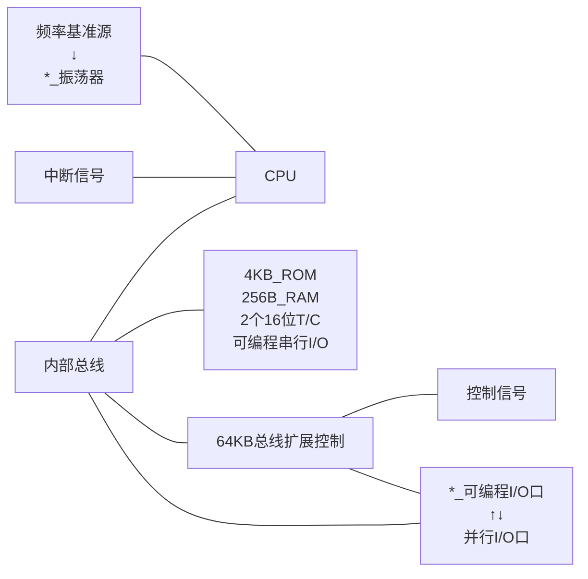

### 0 考试题型
- 计算题40分（数值转换、原反补转换、逻辑运算、目标地址、延时、计数初值）
- 论述题15分
- 连线题15分
- 编程题30分
### 1 绪论
- 定义：将计算机的基本功能器件，包括CPU、存储器、输入/输出接口、定时器/计数器、中断系统、系统时钟、系统总线等，全部集成在一块集成电路芯片的单片微型计算机，简称单片机。
### 2 计算机基础知识
- 进制转换（2，8，10，16）、BCD码（==慢点，别错==）
- 原码、反码、补码转换
	- 正数不变
	- 负数符号位不变，反码
- 与（$\times$、$\wedge$、$\cdot$）、或（$+$、$\vee$）、非（$A\to\overline A$）、异或（$\oplus$）（==符号和数电的不太一样==）
- 微型计算机：硬件系统（CPU、存储、IO）+软件系统（系统、应用）
	- 以运算器为核心
		- 数据：输入 → ALU → 输出；ALU → 存储器；存储器 → ALU、控制器
		- 控制：ALU → 控制器；控制器 → 一切
	- 以存储器为核心（现代主流）
		- 数据：内存储器 ←→ IO / 运算器|寄存器 / 外存储器
		- 控制：控制器 → 一切
- 工作过程：取指令阶段、执行指令阶段
	- 程序计数器 → 存储器 → 指令寄存器
	- 指令译码器 → 指令寄存器
	- 执行指令的时间成为指令周期：取指令阶段、执行指令阶段。
### 3 硬件结构
#### 3.1 内部逻辑结构

#### 3.2 CPU
- 累加器ACC（A）
	- ALU操作数（）
	- 运算结果暂存（`A+=,-=,*=,/=,&=,|=,取反,^=`）
	- 数据中转（`MOVX @DPTR, A`→`MOV A, ST`）
	- 变址寄存（`@A+DPTR`）
- B寄存器：乘除法（`A*B → BA; A/B → A, mod(B)`）
- 程序状态字：Cy → C
	- `Cy | AC | F0 | RS1 | RS0 | OV | / | P`
- 程序计数器：PC（16位）

#### 3.3 内部存储器
$$内部存储器\begin{cases}RAM\begin{cases}高128位\begin{cases}F0H\to B\\E0H\to A\\D0H\to PSW:Cy|AC|F0|RS1|RS0|OV|/|P\\B8H\to IP\\B0H\to P3\\A8H\to IE:EA|/|/|ES|ET1|EX1|ET0|EX0\\A0H\to P2\\98H\to SCON\\90H\to P1\\8DH\sim8AH\to TH1/TH0/TL1/TL0\\89H\to TMOD:\left(GATE|C/\overline T|M1|M0\right)^2\\88H\to TCON:赋值TF1/TF0,TR1/TR0\\87H\to PCON:IDL\to低功耗/PD
\to掉电\\83H\sim82H\to DPH/DPL\\81H\to SP\\80H\to P0\end{cases}\\低128位\begin{cases}30H\sim7FH\to用户RAM区\\20H\sim2FH\to位寻址区(00H\sim7FH)\\00H\sim1FH\to4组通用寄存器\end{cases}\end{cases}\\ROM\begin{cases}0000H\sim0002H\to启动单元\\0003H\sim000AH\to INT0\\000BH\sim0012H\to T0\\0013H\sim001AH\to INT1\\001BH\sim0023H\to T1\\0023H\sim002AH\to RI/TI\end{cases}\end{cases}$$
- 特殊功能寄存器（SFR）
- ROM
	- 中断（6个源，5个项）
	- 并行I/O口：P0和P2较重要
- 时钟和定时
	- 晶振频率：1.2~33MHz
	- 时钟电路：T=6S=12P
- 系统复位：常用寄存器的初值（SP→07H；Pn→FFH）
### 4 指令系统（作为程序去考，指令格式要写对，大小写不要混在一起）
#### 4.1 格式规范
- $R_n,@R_i$等
- rel：PC$_n$ → PC$_{n+1}$ + rel
#### 4.2 指令类型（不要自己创造，看图，考试时只用最确定的）
- 传送类指令
```text
MOV:
	A | direct | Rn | @Ri, #data
	DPTR, #data16
	direct ←→ direct2,Rn,@Ri
	A ←→ direct,Rn,@Ri
MOVX:
	A ←→ @Ri,@DPTR
MOVC A, @A+PC | @A+DPTR
XCH A, Rn | direct | @Ri
XCHD A, @Ri
SWAP A
PUSH | POP direct
```
- 算数指令：**DPTR只能加不能减**
```text
ADD | ADDC | SUBB A, #data | direct | Rn | @Ri
INC A | direct | Rn | @Ri | DPTR
DEC A | direct | Rn | @Ri
MUL | DIV AB
DA A
```
- 逻辑运算/移位
```text
ANL | ORL | XRL:
	A, direct | #data | Rn | @Ri
	direct, A | #data
CLR | CPL | RL | RR | RLC | RRC A
```
- 转移（算地址要注意1+9=A）
```text
LJMP addr16 | AJMP addr11 | ACALL addr11 | LCALL addr16
SJMP rel | $
JMP @A+DPTR
JZ | JNZ rel
CJNE ↓, rel:
	A, #data | A, direct | Rn, #data | @Ri, #data
DJNZ Rn | direct, rel
RET | RETI
```
- 空操作：`NOP`
- 位操作
```text
MOV:
	C ←→ bit
SETB | CLR | CPL C | bit
ANL | ORL C, bit | /bit
JC | JNC rel
JB | JNB | JBC bit, rel
```
### 5 程序设计
#### 5.1 伪代码
```text
ORG
DB | DW | DS
<字符名字> BIT <位地址>
```
#### 5.2 程序结构
- 顺序结构
- 分支结构
	- 单分支：
	- 多分支
```text
MOV A, n         ; A = n
MOV DPTR, TAB    ; DPTR = TAB
MOVC A,@A+DPTR   ; A = BRn-TAB
JMP @A+DPTR      ; → BRn
TAB:DB BR0-TAB
DB BR1-TAB
...
BR0:
...
BR1:
...
```
- 循环
```text
LOOP:
...
DJNZ Rn, LOOP
```

### 6 中断和定时
- 中断
	- 寄存器
	- 响应过程
	- 流程图
		- 主程序：无中断请求 → 执行下一条指令
		- 有中断请求 → 关中断 → 保护现场和断点 → 开中断
		- 中断服务 → 关中断 → 恢复现场 → 开中断 → 返回
- 定时/计数（计算）
	- M0：8192；M1：65536；
```assembly
MOV IE, #00H           ; 禁用中断
MOV TMOD, #02H         ; T1 → M0(咱不用), T0 → M2
MOV TH0, #xxH          ; 260 - T
MOV TL0, #xxH          ; 256 - T
SETB TR0;
LOOP: JBC TF0, LOOP1
AJMP LOOP
LOOP1: 
...
AJMP LOOP
```
### 7 并行扩展
#### 7.0 三总线
- 地址总线（AB） ← P0（低）+P2（高）
- 数据总线（DB） ← P0
- 控制总线（CB） ←
	- ==ALE：地址选通，连锁存器==
	- EA（不是 IE.7）外部 ROM 选择，低电平有效<p style="text-align:center;font-size:50px">QwQ</p>
	- PSEN：扩展ROM
	- RD & WR：数据存储器的 I/O
	- $\overline{CE}$（片选信号）=$P2.7$
#### 7.1 ROM
- PSEN - OE
- ALE - 锁存器
- P0 - O，通过锁存器 → A
- P2.2\~P2.0 - A10\~A8
- P2.7 → 反相器 → $\overline{CE}$
#### 7.2 RAM
- RD - OE：outppu enable
- WR - WE：write enable
- ALE - 锁存器
- P0 - D，通过锁存器 → A
- P2.2\~P2.0：A10\~A8
### 8 练习题
#### 1 无符号二进制数转化为十进制数

  1111000B= 120D              10001010B=138D         01001100B=76D  

  11001101B=205D             10111111B=191D         11111111B=255D

  10101010B=170D             11100111B=231D         10011011B=155D

#### 2 十进制数转化为二进制数

255D=11111111B             127D=01111111B        85D=01010101B

235D=11101011B             128D=10000000B        99D=01100011B

205D=11001101B             105D=01101001                  15D=00001111B

#### 3 二进制数与十六进制数之间的转换

10H=10000B                 55H=01010101B           100H=100000000B

11111111B=FFH              10111100B=BCH           10001001B=89H

#### 4 详细描述内部数据存储器低128个字节的功能区域结构

80C51的内部数据存储器低128个字节单元区称为内部RAM，地址为00H-7FH，是供用户使用的数据存储单元，
按用途可分为如下3个区域：
1）**寄存器区**，内部RAM的前32个单元是作为寄存器使用的，共分为四组，依次为0、1、2、3，每组有8个寄存器，按R0-R7进行编号，4组通用寄存器占据内部RAM的00H-1FH单元地址；
2）**位寻址区**，内部RAM的20H-2FH单元，既可作位一般的RAM单元使用，进行字节操作，也可对单元中的每一位进行位操作，共有16个RAM单元，总结128个可直接寻址位，位地址位00H-7FH；
3）用户RAM区，80个单元提供给用户使用，作为一般RAM区，单元地址为30H-7FH，只能作为存储单元的形式来使用，堆栈开辟在此区域中。

#### 5 描述下列指令或语句的功能(具体见指令描述)
```
DEC @R0
RLC A
AJMP addr11
HERE: SJMP HERE  
CJNE A,#data,rel
JZ rel
JNC rel
DJNZ R2,rel
```
6 延时计算：假定80C51单片机的晶振频率为6MHz，试计算
1）单片机的机器周期     T=12/(6MHz)=2 µs
2）下列程序的执行时间
(注：MOV，NOP为1周期指令，DJNZ，RET为2周期指令)
```assembly
MOV R3, #10H      ;1T
DL1: MOV R4, #20H ;1T,l1
DL2: MOV A, R3    ;1T,l2
NOP               ;1T
DJNZ R4, DL2      ;2T,l2
DJNZ R3, DL1      ;2T,l1
RET               ;2T
```
执行时间t=1T+(1T+(1T+1T+2T)\*20H+2T)\*10H+2T=3T+(3T+4T\*32)\*16=2099\*2µs=4198µs